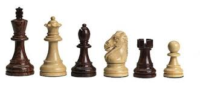

# Pgn File Check

### What does pgn file check do?:
As the name states, program checks prn chess file format and finds errors. It does not repair 
files yet. Program is very fast, and can take thousands of pgn files at once. 

Program checks if pgn tags have right format, and if move syntax is right. It does not try 
to play the pieces on the board if the moves are actually playable, it will be implemented
later. 

Program prints if the file given are okay, prints message if any error is presented and 
gives informations about the error.

---

### Why use Pgn File Check?
Pgn is the most used format to store chess games. There are tools to play the game on 
a chessboard, analyze the game with computer, but what about checking if the pgn 
file contains errors? What about repairing those errors? 

It is very common, you want to send the game to your friend, but no program can play
the moves, because there is error in the pgn syntax. You are frustrated, did your game
disappear? Is it unrepairable? Luckily most people make same mistakes in the pgn file
syntax, and this program aims to locate those errors.

---

### How to use Pgn File Check?
Script is called from console with calling main function.

Calling with no arguments:
```
python main.py
```
Loads all files from input_files that ends with .txt and .pgn

Calling with arguments [inp_file]
```
python main.py inp_file1 inp_file2 ...
```
Loads all files provided from input_files/ directory, also searches in general directory.
